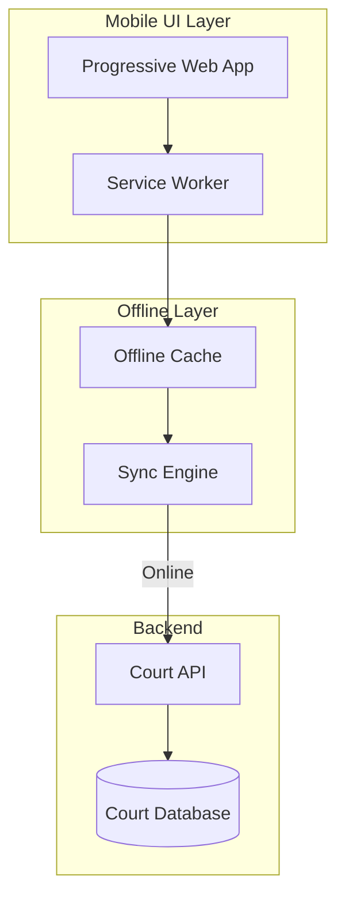

# 📱 Mobile-First Court Access Kit

**Justice from a smartphone.**

[](LICENSE)
[](CONTRIBUTING.md)
[](https://github.com/dougdevitre/mobile-court-access/pulls)

---

## The Problem

Over 15% of court users rely solely on smartphones to access the justice system. Most court websites and portals were built for desktop browsers — they break on small screens, fail without a stable connection, and are impossible to navigate without a mouse and keyboard.

Rural and low-income populations are hit hardest. When the courthouse is 90 minutes away and your only computer is a phone, a broken mobile experience is a denial of justice.

## The Solution

A mobile-first, offline-capable court access kit built from the ground up for smartphones. Responsive templates that work on any screen size. Offline mode that syncs when connectivity returns. Low-bandwidth optimization for rural areas. Voice navigation for accessibility.

This is not a responsive retrofit — it is mobile-first by design.

---

## Architecture



---

## Who This Helps

| Audience | How This Helps |
|---|---|
| **Rural communities** | Access court services without driving to the courthouse |
| **Low-income litigants** | Full functionality on budget smartphones and slow connections |
| **Court administrators** | Reduce in-person traffic with better digital access |
| **Legal aid clinics** | Help clients navigate court systems from their phones |

---

## Features

- [ ] Responsive UI component library optimized for mobile
- [ ] Offline mode with background sync via Service Worker
- [ ] Low-bandwidth mode — compressed assets, deferred images, text-first rendering
- [ ] Voice navigation for hands-free operation
- [ ] Progressive Web App (PWA) support — installable, home screen icon
- [ ] Accessibility-first design (WCAG 2.1 AA)
- [ ] Touch-optimized navigation and form inputs

---

## Tech Stack

| Layer | Technology |
|---|---|
| Framework | Next.js |
| Language | TypeScript |
| Offline | Service Worker + Cache API |
| Testing | Vitest |
| Linting | ESLint + Prettier |

---

## Quick Start

```bash
git clone https://github.com/dougdevitre/mobile-court-access.git
cd mobile-court-access
npm install
npm run dev
```

---

## Justice OS Ecosystem

| Repo | Description |
|---|---|
| [justice-os](https://github.com/dougdevitre/justice-os) | Core modular platform |
| [mobile-court-access](https://github.com/dougdevitre/mobile-court-access) | Mobile-first court access (you are here) |
| [vetted-legal-ai](https://github.com/dougdevitre/vetted-legal-ai) | RAG engine with citation validation |
| [court-doc-engine](https://github.com/dougdevitre/court-doc-engine) | Document automation for legal filings |

---

## Contributing

See [CONTRIBUTING.md](CONTRIBUTING.md) for guidelines.

## License

MIT — see [LICENSE](LICENSE).
