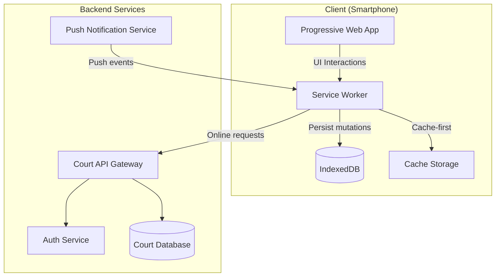
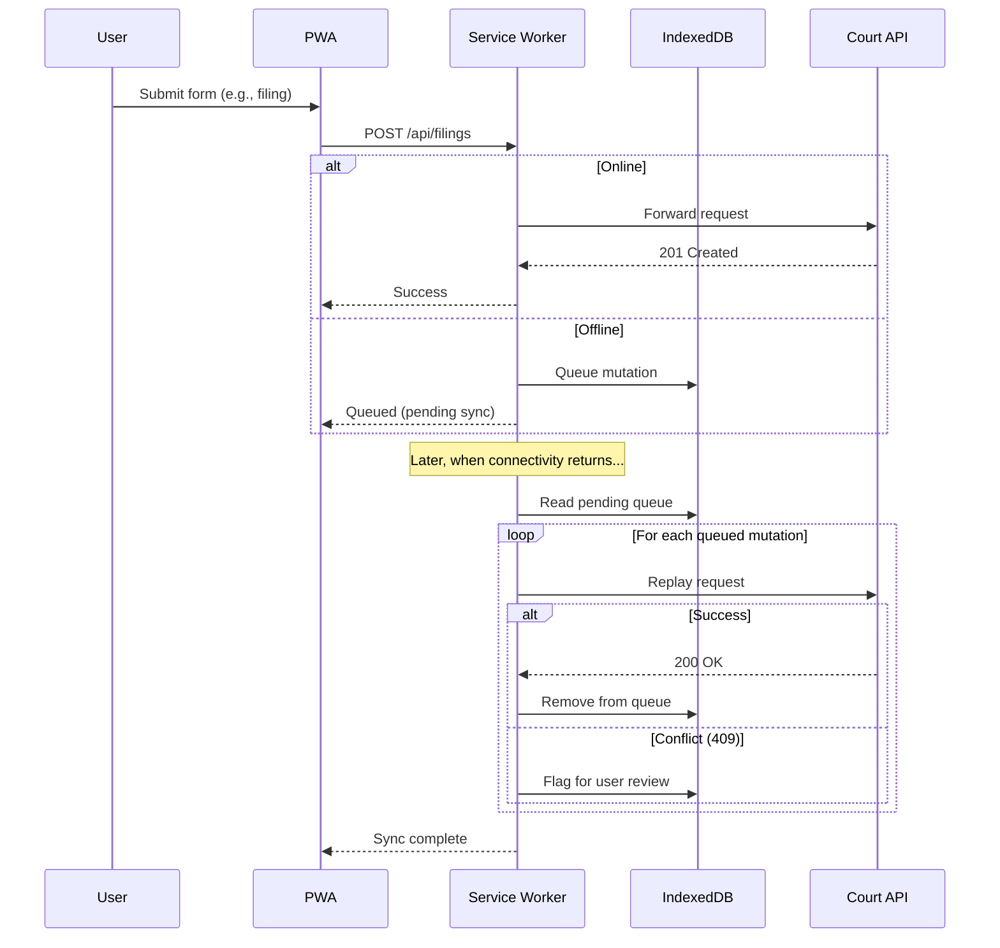
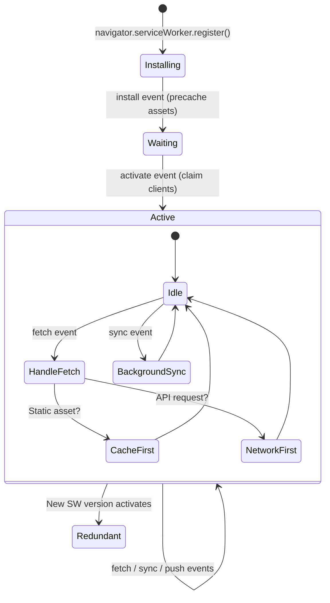
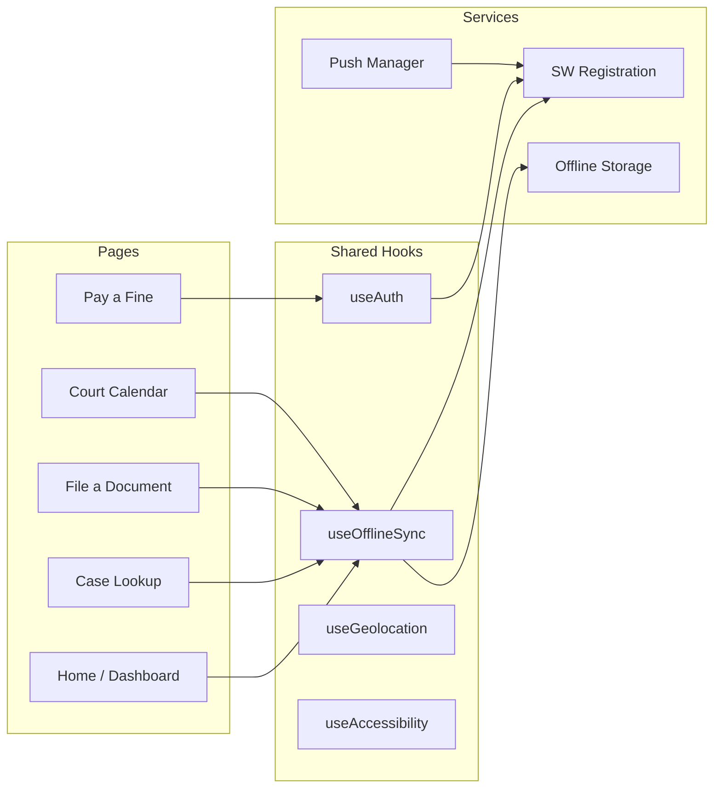

# Architecture — Mobile Court Access

## System Overview

```mermaid
graph TD
    subgraph Client["Client (Smartphone)"]
        PWA[Progressive Web App]
        SW[Service Worker]
        IDB[(IndexedDB)]
        CACHE[Cache Storage]
    end

    subgraph Backend["Backend Services"]
        API[Court API Gateway]
        AUTH[Auth Service]
        NOTIFY[Push Notification Service]
        DB[(Court Database)]
    end

    PWA -->|UI Interactions| SW
    SW -->|Cache-first| CACHE
    SW -->|Persist mutations| IDB
    SW -->|Online requests| API
    API --> AUTH
    API --> DB
    NOTIFY -->|Push events| SW
```

## Offline Sync Flow

```mermaid
sequenceDiagram
    participant User
    participant PWA
    participant SW as Service Worker
    participant IDB as IndexedDB
    participant API as Court API

    User->>PWA: Submit form (e.g., filing)
    PWA->>SW: POST /api/filings
    alt Online
        SW->>API: Forward request
        API-->>SW: 201 Created
        SW-->>PWA: Success
    else Offline
        SW->>IDB: Queue mutation
        SW-->>PWA: Queued (pending sync)
    end

    Note over SW: Later, when connectivity returns...

    SW->>IDB: Read pending queue
    loop For each queued mutation
        SW->>API: Replay request
        alt Success
            API-->>SW: 200 OK
            SW->>IDB: Remove from queue
        else Conflict (409)
            SW->>IDB: Flag for user review
        end
    end
    SW-->>PWA: Sync complete
```

## Service Worker Lifecycle

```mermaid
stateDiagram-v2
    [*] --> Installing: navigator.serviceWorker.register()
    Installing --> Waiting: install event (precache assets)
    Waiting --> Active: activate event (claim clients)
    Active --> Active: fetch / sync / push events
    Active --> Redundant: New SW version activates

    state Active {
        [*] --> Idle
        Idle --> HandleFetch: fetch event
        HandleFetch --> CacheFirst: Static asset?
        HandleFetch --> NetworkFirst: API request?
        CacheFirst --> Idle
        NetworkFirst --> Idle
        Idle --> BackgroundSync: sync event
        BackgroundSync --> Idle
    }
```

## Component Interaction

```mermaid
graph LR
    subgraph Pages
        HOME[Home / Dashboard]
        CASE[Case Lookup]
        FILE[File a Document]
        PAY[Pay a Fine]
        SCHED[Court Calendar]
    end

    subgraph Shared Hooks
        SYNC[useOfflineSync]
        AUTH[useAuth]
        LOC[useGeolocation]
        A11Y[useAccessibility]
    end

    subgraph Services
        SWREG[SW Registration]
        PUSH[Push Manager]
        STORAGE[Offline Storage]
    end

    HOME --> SYNC
    CASE --> SYNC
    FILE --> SYNC
    PAY --> AUTH
    SCHED --> SYNC
    SYNC --> STORAGE
    SYNC --> SWREG
    AUTH --> SWREG
    PUSH --> SWREG
```
